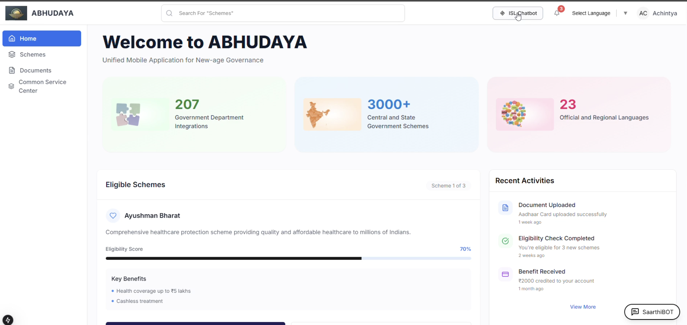
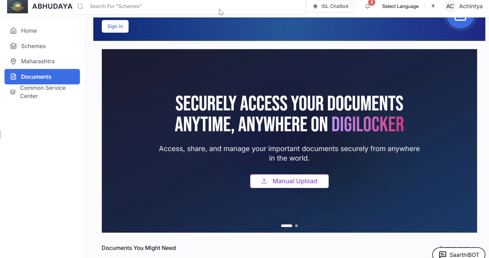
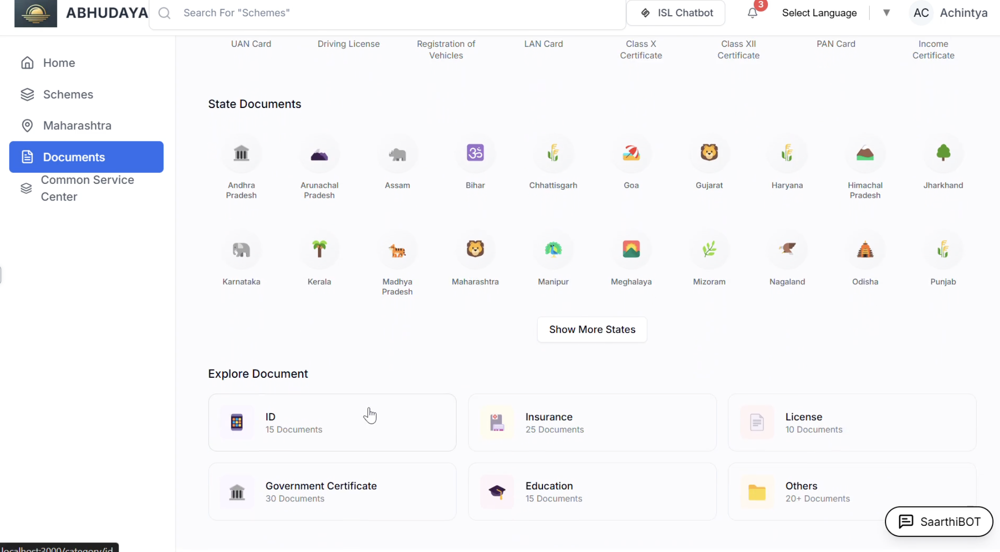
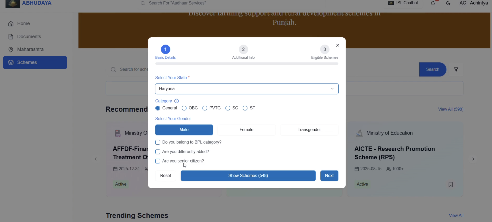
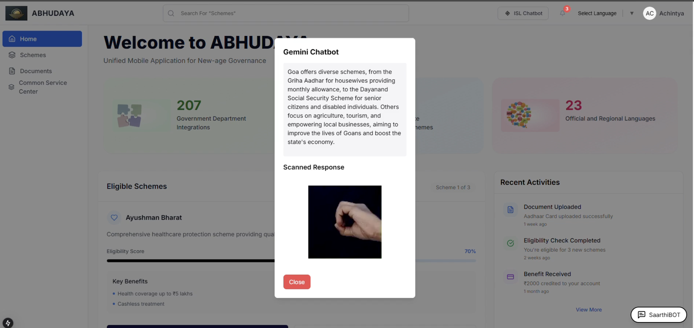
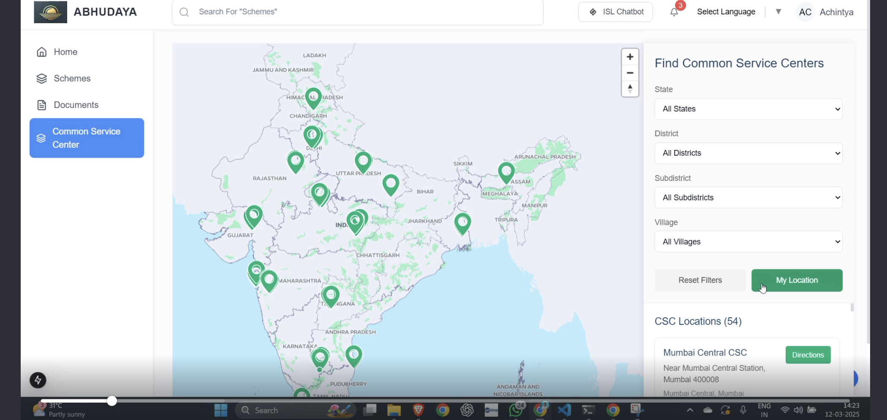
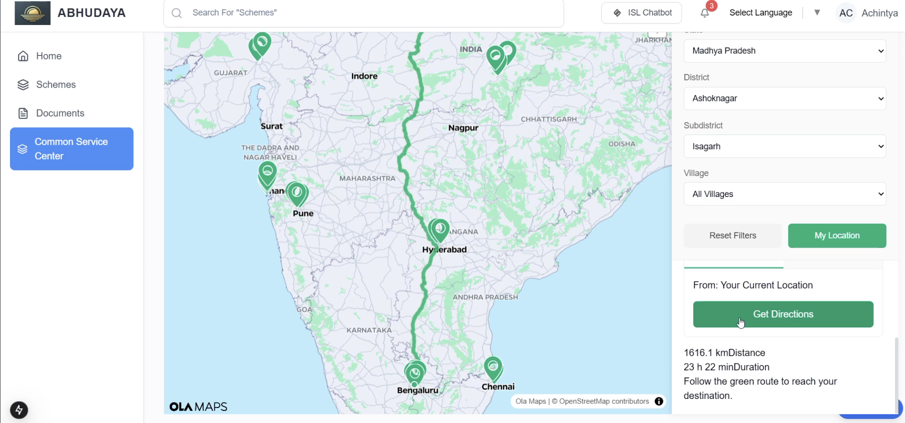
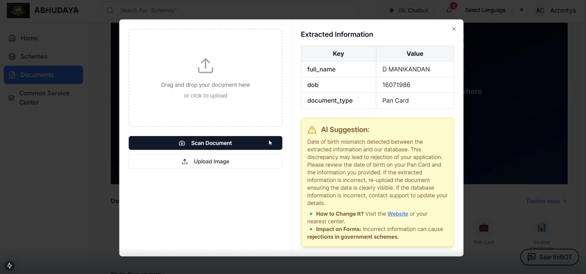
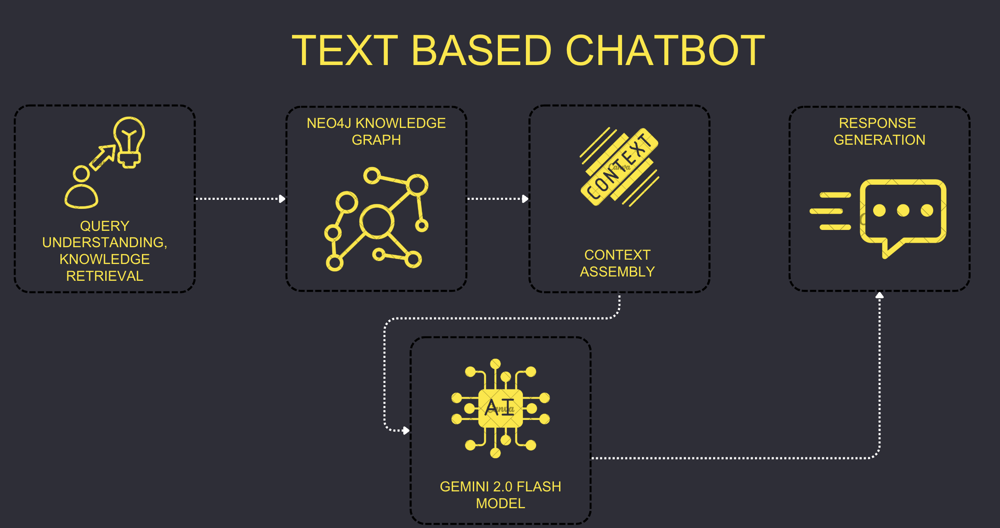
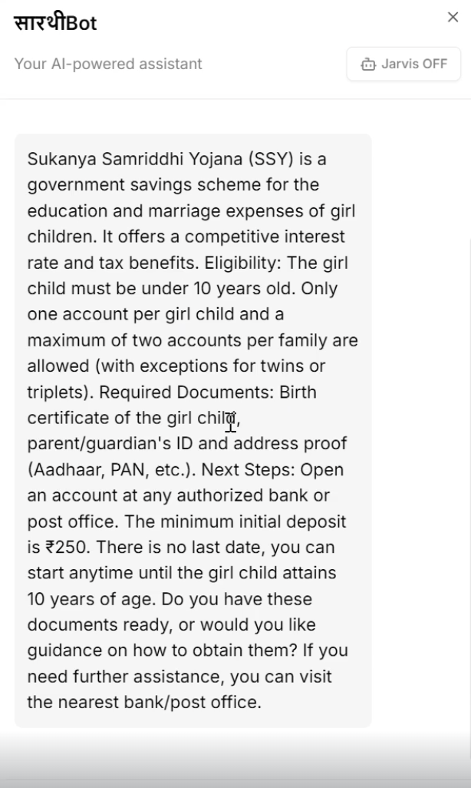

# ABHUDAYA - AI-Powered Government Welfare Scheme Manager

## Theory in Brief
ABHUDAYA is a revolutionary platform that merges advanced AI with graph-based data modeling to simplify access to government welfare schemes. At its core, ABHUDAYA dynamically connects scheme data—scraped directly from government websites—using a graph-based tracking model. This sophisticated approach allows the system to semantically map user profiles to the most relevant schemes. Powered by state-of-the-art natural language processing (NLP) and optical character recognition (OCR) technologies, ABHUDAYA delivers real-time, multi-modal communication across text, voice, and sign language interfaces.

## Solution Overview
ABHUDAYA is engineered as an end-to-end technical solution that redefines how users interact with government welfare schemes:

- **Graph-Based Data Model:**  
  Utilizes a dynamic graph-based tracking model integrated with Gemini-2.0-Flash. Scheme data scraped from government portals is organized into nodes and edges, creating an evolving, real-time map of available welfare schemes.
  
- **AI-Driven Interactions:**  
  The multi-modal AI assistant interacts via both text and voice in 23 Indian languages, enhanced by a custom dataset for Indian Sign Language (ISL). This ensures every user, regardless of language or ability, can navigate the system with ease.

- **Automated Eligibility & Document Verification:**  
  Qwen OCR extracts text from uploaded documents, and Gemini-2.0-Flash processes this data for seamless document verification and eligibility checks.

- **Geospatial Mapping Integration:**  
  By integrating with Google Maps, ABHUDAYA provides real-time location data, enabling users to pinpoint nearby Common Service Centers (CSCs) with detailed routing, tagging, and event control features.

- **Voice Agent Capabilities:**  
  A dedicated voice-based chatbot in Hindi, Marathi, and English offers an intuitive, hands-free interaction mode.

- **Project IDX Integration:**  
  Developed under Google's Project IDX, ensuring cutting-edge development practices and scalable, robust performance.

## Key Technical Features
- **Graph-Based Tracking Model:**  
  - Leverages Gemini-2.0-Flash for context-aware scheme recommendations.
  - Dynamically maps relationships between user profiles and schemes using data scraped from official sources.

- **Multilingual AI Chatbot:**  
  - Supports 23 Indian regional languages and a custom-built ISL dataset.
  - Utilizes advanced NLP algorithms to interpret and respond to user queries in both text and voice formats.

- **Automated Document Verification:**  
  - Employs Qwen OCR to extract text from documents.
  - Uses Gemini-2.0-Flash to verify and validate document details for eligibility.

- **CSC and Kiosk Locator:**  
  - Integrates with Google Maps for precise geospatial tracking.
  - Offers comprehensive routing, tagging, and navigation features to locate the nearest CSC or kiosk.

- **Voice Agent Integration:**  
  - Delivers an interactive conversational interface using text-to-speech and speech-to-text APIs.
  - Available in Hindi, Marathi, and English for a seamless user experience.

## Technology Stack

### Frontend
- **React.js:** For building an interactive and dynamic user interface.
- **Next.js:** Provides server-side rendering for improved performance and SEO.
- **Tailwind CSS:** Delivers a modern, responsive UI design.
- **Redux Toolkit:** Manages state efficiently across the application.

### Backend
- **Node.js & Express.js:** Handles API requests, business logic, and server-side operations.
- **MongoDB:** Stores structured user data and dynamic scheme details.
- **Google OAuth Authentication:** Ensures secure and reliable user authentication.
- **GraphQL:** Facilitates efficient and precise data fetching between client and server.

### AI & Data Processing
- **Gemini-2.0-Flash (LLM):** Powers advanced NLP for the chatbot, document processing, and recommendation systems.
- **Graph-Based Tracking Model:** Integrates scheme data into a dynamic, real-time graph.
- **Qwen OCR Model:** Extracts text from images and documents for automated verification.
- **Transcription & Translation APIs:** Enable multi-language interactions and content accessibility.
- **Google Maps Integration:** Provides geospatial mapping and route optimization for CSC and kiosk location services.

## How It Works
1. **User Sign-Up & Profile Creation:**  
   Users register and create profiles by providing key details such as demographics, income, and occupation.
2. **Graph-Based AI Chatbot Interaction:**  
   ABHUDAYA processes user queries through a graph-based model combined with Gemini-2.0-Flash. By leveraging real-time data scraped from government websites, it effectively maps user profiles to the most relevant schemes.
3. **Document Upload & Verification:**  
   Users upload their documents, which are processed via Qwen OCR. Gemini-2.0-Flash then verifies the extracted data to ensure eligibility and compliance.
4. **Scheme Recommendation:**  
   The system suggests tailored government welfare schemes based on user profiles and verified information.
5. **CSC & Kiosk Locator:**  
   For users with limited connectivity, ABHUDAYA integrates with Ola Maps to locate nearby CSCs and kiosks, complete with detailed navigation and routing features.
6. **Voice Agent Interaction:**  
   A dedicated voice-based interface enables interactive conversations in Hindi, Marathi, and English, catering to various user needs.
7. **Future Expansion:**  
   Planned enhancements include expanding the ISL chatbot using our proprietary dataset and further integration with government portals for streamlined application processing.

## Snapshots and Demo Videos
Dive into our interactive world!  
 **Snapshots:**  
  Experience a visual tour of our platform through high-resolution snapshots that capture every technical detail and user interaction.  
    
  
  
  
    
    
    
    
  
  
  
  
  

**Demo Videos:**  
  Watch our demo videos to see ABHUDAYA in action—from graph-based data processing to real-time, multi-modal communication. [https://youtu.be/B_AyO3bvZO8]

## Contributors
We welcome contributions from passionate developers and AI enthusiasts. If you're interested in collaborating, please submit a pull request or reach out to our team.

## License
This project is licensed under the MIT License.
